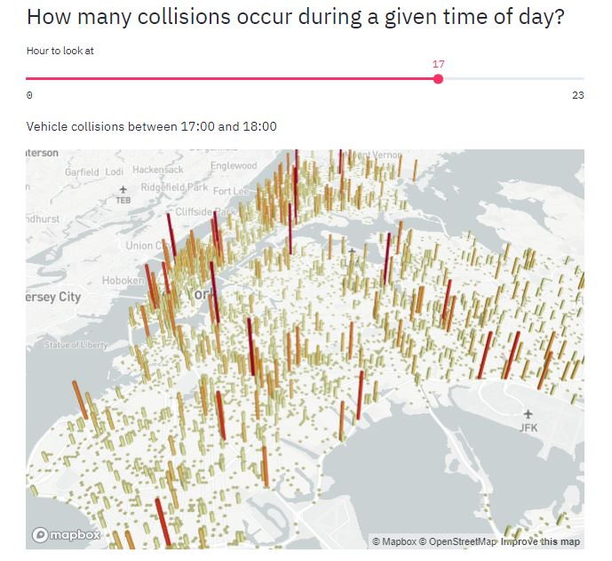
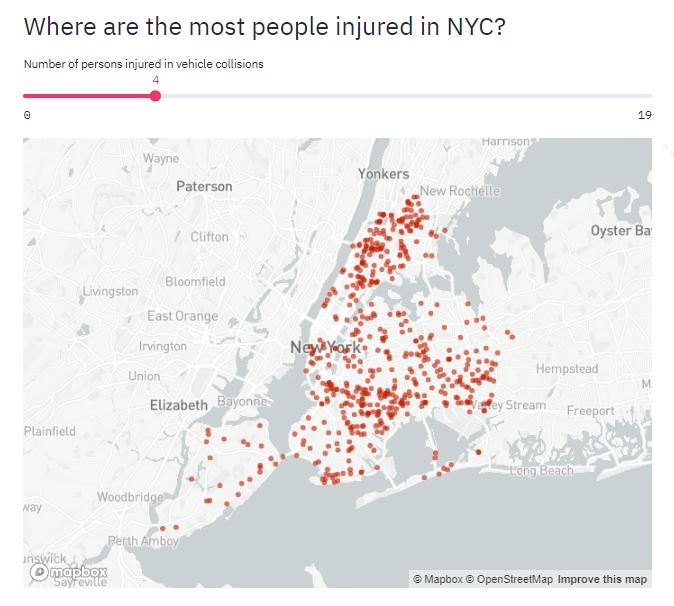

# Vehicle-Collision-NYCity-Project
## This project uses streamlit library in python to built an interactive Webapp.

In the above code I have loaded, explored, visualized and interact with data, and generated dashboards in less than 100 lines of Python code! 

Link for dataset: https://data.cityofnewyork.us/Public-Safety/Motor-Vehicle-Collisions-Crashes/h9gi-nx95

Things covered in this project are

1: Turn Simple Python Scripts into Web Apps

2: Load the Motor Vehicle Collisions Data

3: Visualize Data on a Map

4: Filtering Data and Interactive Tables

5: Plot Filtered Data on a 3D Interactive Map

6: 3D Interactive Map

7: Charts and Histograms

8: Select Data Using Dropdowns

This Project precisely consists of:-

-> Where are the most people injured in NYC?

-> How many collisions occur during a given time of day?

-> Top 5 dangerous streets by affected class( Pedestrians, Cyclists & Motorists)

I have also included Slider widget in my web app which updates dynamically through which we can know

-> Number of persons injured in vehicle collisions by sliding

-> At what time of day collisions happened
